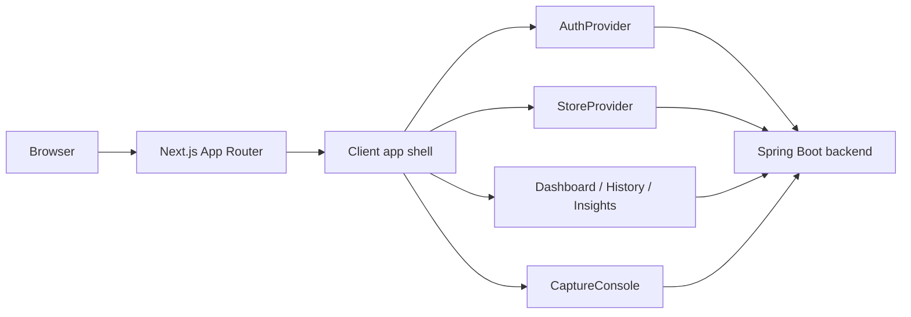
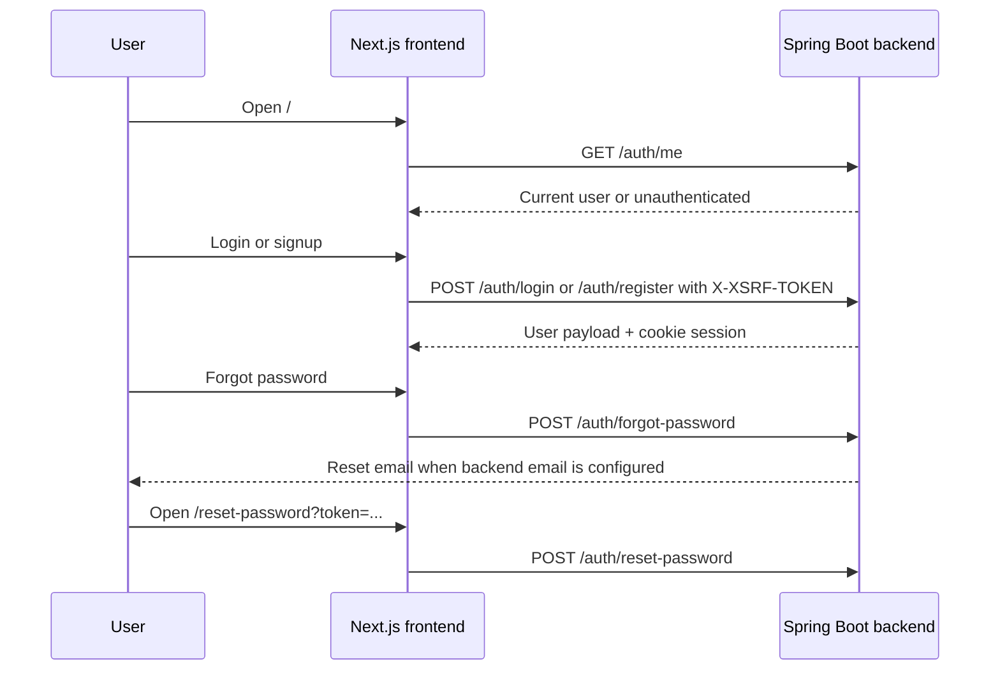
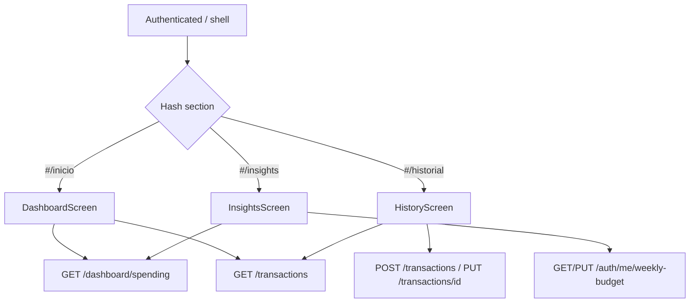
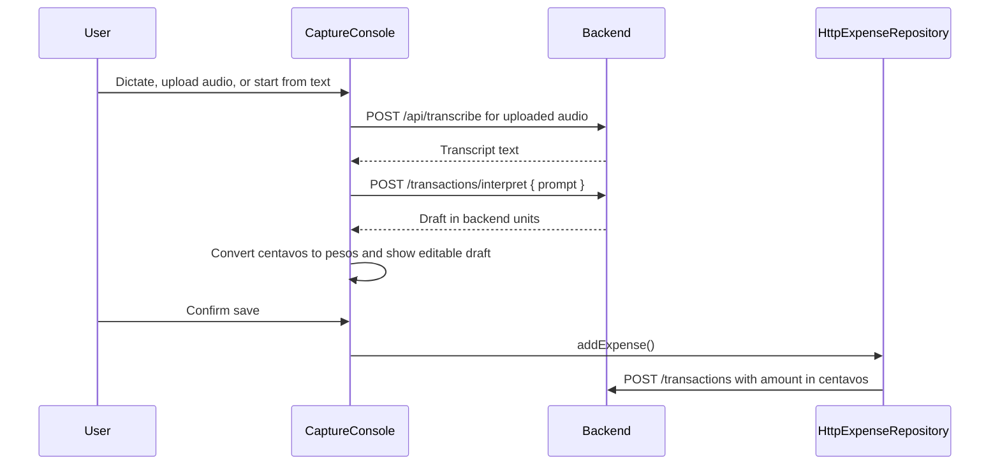

# Budgeting Frontend

Frontend app for the Budgeting MVP: a Next.js App Router interface that lets an authenticated user review spending, manage a weekly budget, and capture expenses with AI assistance while keeping the final save under human control.

The project is intentionally lean. It uses a root app shell with hash-routed product sections, a real password-reset route, backend-backed transaction/dashboard/budget data, cookie-session authentication with XSRF protection, and a Linear-inspired dark design system documented in `DESIGN.md`.

## Current MVP surface

| Area              | Route / surface                                   | Purpose                                                                                   |
| ----------------- | ------------------------------------------------- | ----------------------------------------------------------------------------------------- |
| Auth              | `/` unauthenticated shell                         | Login/signup against the backend session endpoints.                                       |
| Password recovery | Login recovery modal, `/reset-password?token=...` | Request a reset email and submit a new password through the backend reset flow.           |
| Panel             | `/#/inicio`                                       | Current-month total, top category, weekly budget status, and latest movements.            |
| Historial         | `/#/historial`                                    | Backend-loaded transaction history with create/update support.                            |
| Insights          | `/#/insights`                                     | Current-month summary, month-over-month comparison, and weekly budget management.         |
| AI capture        | Floating capture console                          | Voice, audio upload, or interpreted text -> editable draft -> explicit user confirmation. |

## Stack

| Component            | Current choice                                                                                                         |
| -------------------- | ---------------------------------------------------------------------------------------------------------------------- |
| Runtime              | Node.js through Next.js local tooling                                                                                  |
| Package manager      | pnpm                                                                                                                   |
| Framework            | Next.js 15.5.19 App Router                                                                                             |
| UI                   | React 18.3.1 + TypeScript 5.7.2 strict mode                                                                            |
| Styling              | Tailwind CSS 3.4, shadcn-compatible primitives, `class-variance-authority`, `tailwind-merge`                           |
| Icons                | `lucide-react`                                                                                                         |
| Tests                | Vitest 4 + JSDOM + Testing Library                                                                                     |
| Formatting / linting | Prettier 3 + ESLint 9 with Next vitals                                                                                 |
| Backend integration  | Next rewrites to Spring Boot at `http://localhost:8080` for `/auth/*`, `/dashboard/*`, `/transactions/*`, and `/api/*` |

## Architecture at a glance



The official MVP shape is a **client-heavy app shell with backend-owned data**:

- `app/page.tsx` renders `components/budgeting-app.tsx`, which gates unauthenticated vs authenticated UI.
- `app/reset-password/page.tsx` is the real App Router page for reset links.
- `AppFrame` owns the authenticated section state (`inicio`, `historial`, `insights`) and syncs it with hash anchors under `/`.
- `lib/auth.tsx`, `lib/store.tsx`, `lib/weekly-budget.ts`, and `lib/insights.ts` are the main backend integration seams.
- `DESIGN.md` remains the visual source of truth; Tailwind tokens and global layers live in `app/globals.css`.

## Core flows worth defending

### Auth, session, and password reset



The frontend does **not** handle JWT bearer tokens. It relies on the backend `JSESSIONID` cookie and sends `X-XSRF-TOKEN` from the `XSRF-TOKEN` cookie on state-changing requests.

### Dashboard, history, and insights shell



Transactions, dashboard totals, and weekly budget are backend-backed by default. Weekly budget has an explicit localStorage fallback only when `NEXT_PUBLIC_USE_BACKEND_WEEKLY_BUDGET=false`.

### AI capture draft flow



AI interpretation never persists a transaction by itself. The frontend always shows an editable confirmation draft before calling the transaction create API.

## Local setup

1. Install dependencies:

   ```bash
   pnpm install
   ```

2. Start the backend on `http://localhost:8080` so the Next rewrites can reach `/auth`, `/dashboard`, `/transactions`, and `/api`.

3. Start the frontend:

   ```bash
   pnpm dev
   ```

   The app runs at `http://localhost:3000` by default.

Optional local-only budget mode:

```bash
NEXT_PUBLIC_USE_BACKEND_WEEKLY_BUDGET=false pnpm dev
```

Use that only when you explicitly want weekly budget state in localStorage instead of the backend.

## Tests and verification

Use the pnpm scripts from `package.json`:

```bash
pnpm format:check
pnpm lint
pnpm test
pnpm exec tsc --noEmit
pnpm build
```

Useful focused checks:

```bash
pnpm test lib/auth.test.tsx
pnpm test lib/store.test.ts
pnpm test lib/format.test.ts
pnpm test components/capture-console.test.tsx
pnpm test components/screens/insights-screen.test.tsx
```

## Reviewer gotchas worth preserving

- `package.json` is still named `cloudscape-starter`; that is a cosmetic starter-template leftover, not the product name.
- App sections are hash-routed inside `/`. Do not add `app/inicio/page.tsx`-style routes unless the routing model is intentionally changed.
- Backend transaction amounts are centavos; frontend `Expense.amount` values are pesos. Conversion belongs in the data layer (`HttpExpenseRepository` and capture mapping), not in screen components.
- `GET /transactions` is consumed as `{ items: [...] }`; invalid categories are filtered against the closed `CATEGORIES` union.
- Deletion is not backend-backed yet. Do not describe it as complete product behavior until the backend contract exists.
- Browser speech recognition uses `es-AR`; uploaded audio goes through `POST /api/transcribe`, then `/transactions/interpret` creates the draft.
- Do not introduce new Cloudscape components. The current UI is the Tailwind/shadcn-compatible system aligned to `DESIGN.md`.

## MVP constraints worth preserving

- Keep manual expense paths available even if AI services fail.
- Keep confirmation-before-save mandatory for every AI-interpreted draft.
- Keep auth aligned to backend cookie session + XSRF, not frontend JWT storage.
- Keep deploy instructions out until the frontend deployment target is actually chosen.
