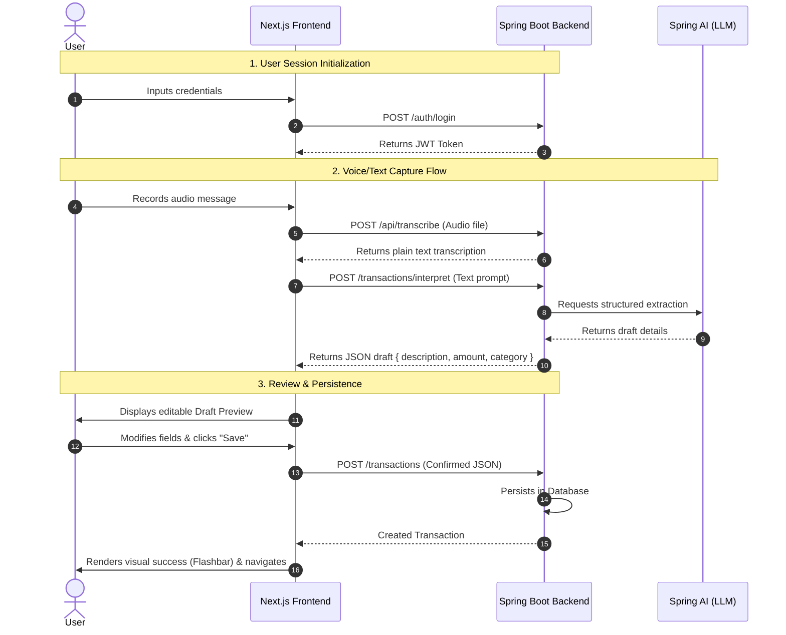

## Product Requirements Document — Budgeting Integrated MVP

### Overview

This document specifies the comprehensive Product Requirements and System Architecture for the Budgeting MVP. Budgeting is an intelligent expense tracking application designed to minimize the day-to-day friction of financial logging.

The product combines a **Next.js** (App Router) frontend styled with a **Linear-inspired stark styling design system (defined in DESIGN.md)** and a **Java Spring Boot / Spring AI** backend. It integrates advanced AI capabilities (voice transcription and natural language interpretation) into a controlled, user-approved logging flow.

---

### System Architecture & Integration Model

The MVP implements a **hybrid, human-in-the-loop** capturing flow. While transcription and interpretation are processed by the backend's AI services, final transaction validation and persistence control remain in the frontend.



---

### API Contracts

All endpoints (except authentication) require a valid JWT token sent in the `Authorization: Bearer <token>` header.

#### 1. Authentication

- **Sign Up**: `POST /auth/signup`
  - Request: `{ "email": "user@example.com", "password": "securepassword" }`
  - Response: `201 Created`
- **Log In**: `POST /auth/login`
  - Request: `{ "email": "user@example.com", "password": "securepassword" }`
  - Response: `200 OK` `{ "token": "jwt-token-string" }`

#### 2. Speech-to-Text

- **Transcribe Audio**: `POST /api/transcribe`
  - Content-Type: `multipart/form-data`
  - Request Part: `file` (Binary audio upload, e.g., WebM or WAV format)
  - Response: `200 OK` (Plain text string of the transcription)

#### 3. AI Interpretation

- **Interpret Natural Language**: `POST /transactions/interpret`
  - Request: `{ "prompt": "Gasté 35 mil en el super" }`
  - Response: `200 OK`
    ```json
    {
      "description": "Compra en el supermercado",
      "amount": 35000,
      "category": "Supermercado"
    }
    ```
  - _Note_: If the AI cannot parse specific fields, it returns them as `null` (e.g., `"amount": null`), which prompts the frontend to request manual inputs.

#### 4. Transaction Management

- **Create/Persist Transaction**: `POST /transactions`
  - Request:
    ```json
    {
      "description": "Supermercado Coto",
      "amount": 35000,
      "category": "Supermercado"
    }
    ```
  - Response: `201 Created` `{ "id": "uuid-string", "date": "2026-06-27T13:22:00Z", ... }`
- **List Transactions**: `GET /transactions`
  - Query Parameters: `category` (optional, string for filtering)
  - Response: `200 OK`
    ```json
    [
      {
        "id": "uuid-1",
        "description": "Nafta YPF",
        "amount": 45000,
        "category": "Auto",
        "date": "2026-06-25T15:30:00Z"
      }
    ]
    ```

---

### Screen & Feature Specifications

#### 1. Dashboard Screen

- **Month Summary Hero**: Large numeric display showing the current month's aggregate spending, total count of movements, and average expense.
- **Categorized Breakdown**: Horizontal progress bars showing relative spend percentages per category.
- **Actionable Insight Cards**: AI-driven observations retrieved or calculated for the dashboard (e.g., highlighting top category spend shares).
- **Recent Table**: Displays the 5 most recent transactions with a link to navigate to the full History.

#### 2. Capture / Chat Screen

- **Audio Capture**: Input interface with microphone control using the browser's audio recording APIs, pushing audio files to the backend for transcription.
- **Text Input**: Back-up text entry for manual typing.
- **Borrador (Draft) Preview**:
  - Displays a warning banner if fields are missing or unparsed.
  - Features edit fields for Description, Amount, and Category dropdown.
  - Confirms persistence visually upon clicking "Guardar gasto", triggering a success Flashbar.

#### 3. History Screen

- **Full Ledger**: Table showing all recorded transactions.
- **Category Filter**: Dropdown to isolate specific spending categories.
- **Manual Form Modal**: Add or edit transaction entries without invoking the AI capture stream.

---

### Business Rules & Scope Boundaries

1. **Human-in-the-loop**: The AI must never persist transactions autonomously. Every parsed transaction must be displayed as a draft for explicit approval by the user.
2. **Safe Fallbacks**: If the transcription API, network, or LLM interpretation fails, the system must fallback gracefully to the manual modal form.
3. **Authentication Boundary**: Real backend-managed accounts are mandatory. Anonymous logging is out of scope.
4. **Audit Scope**: Deletion of transactions is out of scope for the MVP.
