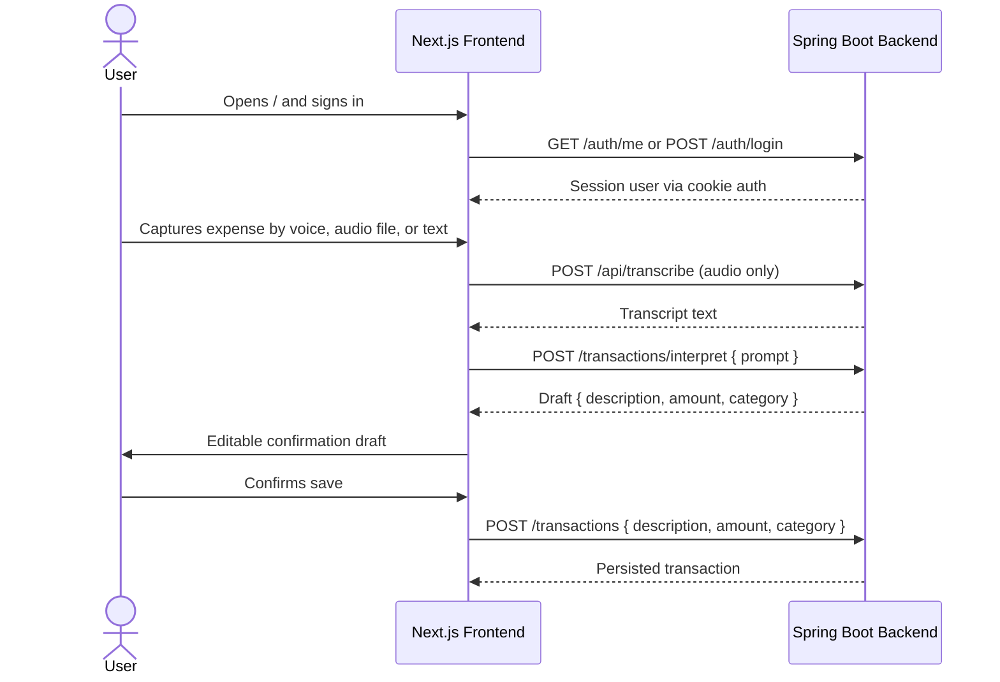

## Product Requirements Document — Budgeting MVP

### Overview

Budgeting is a backend-connected expense tracking MVP for quickly capturing spending, reviewing an AI-produced draft, and saving only after explicit user confirmation. The frontend is a **Next.js App Router** app using the Linear-inspired design system in `DESIGN.md`; the backend is **Spring Boot / Spring AI**.

The MVP defense is simple: reduce logging friction without giving AI autonomous write access.

---

### Current Product Shape

| Area    | Current requirement                                                                                                                                                                     |
| ------- | --------------------------------------------------------------------------------------------------------------------------------------------------------------------------------------- |
| Routing | `/` is the main app shell. App sections are hash-based: `#/inicio`, `#/historial`, `#/insights`. `/reset-password?token=...` is the real route for reset links.                         |
| Auth    | Backend-managed cookie session. Mutations send `X-XSRF-TOKEN` from the `XSRF-TOKEN` cookie. Do not document or implement JWT bearer auth in the frontend.                               |
| Data    | Transactions, dashboard stats, and weekly budget are backend-backed. The weekly budget keeps an explicit localStorage fallback only when `NEXT_PUBLIC_USE_BACKEND_WEEKLY_BUDGET=false`. |
| Capture | Voice/audio/text capture produces text, then the frontend calls backend `POST /transactions/interpret` to create an editable draft.                                                     |
| Safety  | Human-in-the-loop confirmation is mandatory. AI output is never persisted until the user reviews and saves.                                                                             |

---

### Runtime Flow



The diagram is intentionally narrow: it shows the defended MVP promise, not every screen interaction.

---

### API Contracts Used by the Frontend

All authenticated calls rely on the backend cookie session. State-changing requests include `X-XSRF-TOKEN` when the cookie is present.

#### Authentication and Session

- `GET /auth/me` → current user `{ id, email }` or unauthenticated status.
- `POST /auth/login` with `{ email, password }` → user `{ id, email }` and session cookie.
- `POST /auth/register` with `{ email, password }` → user `{ id, email }` and session cookie.
- `POST /auth/logout` → clears session.
- `POST /auth/forgot-password` with `{ email }` → `202 Accepted` when the reset email flow is accepted.
- `POST /auth/reset-password` with `{ token, newPassword }` → `204 No Content` on success.

#### Capture and Transactions

- `POST /api/transcribe` accepts `multipart/form-data` audio file and returns transcript text.
- `POST /transactions/interpret` accepts `{ "prompt": "Gasté 35 mil en el super" }` and returns a draft:
  ```json
  {
    "description": "Compra en supermercado",
    "amount": 3500000,
    "category": "SUPERMERCADO"
  }
  ```
  `amount` is centavos at the API boundary; the frontend converts it to pesos before rendering the draft.
- `GET /transactions` returns a paged/list envelope:
  ```json
  {
    "items": [
      {
        "id": 1,
        "description": "Nafta YPF",
        "amount": 4500000,
        "category": "TRANSPORTE",
        "date": "2026-06-25T15:30:00Z"
      }
    ]
  }
  ```
- `POST /transactions` and `PUT /transactions/{id}` send `amount` in centavos. The UI model stores amounts in pesos, so conversion belongs in the repository/data layer.

#### Dashboard and Budget

- `GET /dashboard/spending` returns month summary data used by the dashboard and insights screens. The frontend sends a `Time-Zone` header.
- `GET /auth/me/weekly-budget` reads the signed-in user's weekly budget.
- `PUT /auth/me/weekly-budget` writes `{ amount }`; `{ "amount": null }` clears it.

---

### Screen Requirements

#### Main Shell (`/`)

- Unauthenticated users see login/signup. Login includes password recovery.
- Authenticated users see `AppFrame` with hash navigation for Panel, Historial, and Insights.
- The floating capture console is globally available and keyboard-accessible through the configured shortcut.

#### Panel (`#/inicio`)

- Shows current month total, movement count, average, top category, weekly budget status, and the five most recent movements.
- Dashboard figures come from backend-backed store/dashboard data, not fixtures.

#### Historial (`#/historial`)

- Shows backend-loaded transactions.
- Create/update paths must preserve centavos↔pesos conversion at the repository boundary.
- Deletion is not backend-backed yet and must not be sold as completed product behavior.

#### Insights (`#/insights`)

- Shows current month summary, month-over-month comparison, and weekly budget management.
- Weekly budget reads/writes the backend by default and updates the Panel status.

#### Capture Console

- Supports browser speech recognition, audio upload, and interpreted text.
- Calls `/transactions/interpret` for the AI draft.
- Requires a visible, editable confirmation step before saving.

#### Reset Password (`/reset-password`)

- Requires a `token` query parameter.
- Submits the new password to `/auth/reset-password` and then returns the user to `/`.

---

### Business Rules and Scope Boundaries

1. **Human-in-the-loop is non-negotiable**: AI can suggest; only the user can persist.
2. **Cookie session + XSRF is the auth model**: no frontend JWT bearer token handling.
3. **Use backend-backed product data**: transactions, dashboard summary, and weekly budget are real integration points.
4. **Keep money units honest**: backend transaction amounts are centavos; frontend UI amounts are pesos.
5. **Closed categories only**: use the `CATEGORIES` union from `lib/types.ts`.
6. **MVP does not require autonomous deletion or hidden AI writes**.
