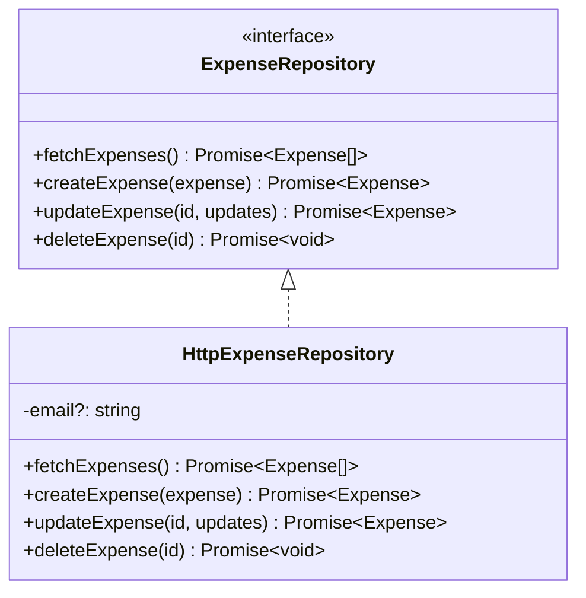

# Design Document: Connect Transactions to Spring Boot Backend

## Architectural Design

We are migrating the budgeting application's data layer from client-side `localStorage` to a Spring Boot REST API. This is accomplished by replacing the `LocalStorageExpenseRepository` with a newly implemented `HttpExpenseRepository` in [store.tsx](file:///home/nico/Escritorio/budgeting-workspace/budgeting-frontend/lib/store.tsx).



## Cookie Extraction Utility

To ensure state-modifying requests satisfy backend CSRF protection rules, the frontend must attach the `X-XSRF-TOKEN` header. A utility helper function `getCookie` will be added to [store.tsx](file:///home/nico/Escritorio/budgeting-workspace/budgeting-frontend/lib/store.tsx) to parse cookies safely on the client side:

```typescript
function getCookie(name: string): string | null {
  if (typeof document === 'undefined') return null
  const match = document.cookie.match(new RegExp('(^| )' + name + '=([^;]+)'))
  return match ? decodeURIComponent(match[2]) : null
}
```

## Mapping Details

### 1. Payload Mapping (Frontend to Backend)

When creating an expense, the client sends a `POST` request to `/transactions`.

- **Amount conversion**: Backend expects transaction amounts to be stored as integers representing cents/centavos. The frontend amount in pesos is converted using `Math.round(amount * 100)`.
- **Headers**: The request must supply a `Content-Type: application/json` header and a CSRF verification header `X-XSRF-TOKEN` containing the token parsed from cookies.

**Request Payload Schema:**

```typescript
interface BackendCreatePayload {
  description: string
  category: 'GROCERIES' | 'PHARMA' | 'AUTO'
  amount: number // Integer in centavos
}
```

### 2. Response Mapping (Backend to Frontend)

The backend returns transaction data with numerical IDs and amounts in cents/centavos.

**Backend Response Schema:**

```typescript
interface BackendTransaction {
  id: number
  description: string
  amount: number // Integer in centavos
  category: 'GROCERIES' | 'PHARMA' | 'AUTO'
}
```

The repository maps each transaction to the frontend [Expense](file:///home/nico/Escritorio/budgeting-workspace/budgeting-frontend/lib/types.ts#L15) interface:

- **id**: `backendTx.id.toString()`
- **description**: `backendTx.description`
- **amount**: `backendTx.amount / 100` (converting centavos back to pesos)
- **category**: `backendTx.category`
- **date**: `new Date().toISOString()` (assigning the current timestamp as a fallback since the backend does not persist transaction dates)

---

## Detailed File Changes

### 1. [lib/store.tsx](file:///home/nico/Escritorio/budgeting-workspace/budgeting-frontend/lib/store.tsx)

- Add `getCookie` helper function.
- Implement `HttpExpenseRepository` class conforming to the `ExpenseRepository` interface.
  - `fetchExpenses()`: requests `/transactions/GROCERIES`, `/transactions/PHARMA`, and `/transactions/AUTO` concurrently using `Promise.all`, aggregates the results, checks response status, and maps them to the local `Expense` schema.
  - `createExpense(input)`: triggers a `POST` request to `/transactions` with the converted payload and CSRF header, validating and returning the mapped response.
  - `updateExpense(id, updates)` and `deleteExpense(id)`: immediately resolve as successful no-ops without firing HTTP network requests.
- Replace the instantiation of `LocalStorageExpenseRepository` in `StoreProvider` with `HttpExpenseRepository`.

### 2. [lib/store.test.ts](file:///home/nico/Escritorio/budgeting-workspace/budgeting-frontend/lib/store.test.ts)

- Completely refactor the test file to test the new `HttpExpenseRepository` behaviors.
- Use Vitest network stubbing for `fetch` to assert request shapes and correct data mapping.

---

## Test Strategy

Tests will run inside a Vitest JSDOM environment, stubbing the global `fetch` function.

### Global Fetch Stubbing

To mock fetch calls correctly, we will define a routing mock handler to resolve responses depending on request path and parameters:

```typescript
import { vi, describe, it, expect, beforeEach, afterEach } from 'vitest'
import { HttpExpenseRepository } from './store'

const mockFetch = vi.fn()

beforeEach(() => {
  vi.stubGlobal('fetch', mockFetch)
  mockFetch.mockReset()
})

afterEach(() => {
  vi.unstubAllGlobals()
})
```

### Scenario Test Implementations

#### 1. Fetching Expenses Concurrently

The test mock must intercept requests to category paths and return appropriate arrays:

```typescript
mockFetch.mockImplementation(async (url: string) => {
  if (url.endsWith('/transactions/GROCERIES')) {
    return {
      ok: true,
      json: async () => [
        { id: 1, description: 'Leche', amount: 15050, category: 'GROCERIES' },
      ],
    }
  }
  if (url.endsWith('/transactions/PHARMA')) {
    return { ok: true, json: async () => [] }
  }
  if (url.endsWith('/transactions/AUTO')) {
    return {
      ok: true,
      json: async () => [
        { id: 2, description: 'Nafta', amount: 500000, category: 'AUTO' },
      ],
    }
  }
  return { ok: false, status: 404 }
})
```

The test asserts:

- Concurrency parameters (using `Promise.all`).
- Mapped output matches expected values (e.g. `amount` is `150.5` and `5000`, IDs are strings `"1"` and `"2"`, and `date` is a valid ISO timestamp).

#### 2. Creating Expenses with CSRF Header

The test modifies `document.cookie` to simulate the CSRF cookie and validates the request headers and payload conversion:

```typescript
document.cookie = 'XSRF-TOKEN=test-csrf-value'

mockFetch.mockResolvedValueOnce({
  ok: true,
  status: 201,
  json: async () => ({
    id: 3,
    description: 'Remedio',
    amount: 20045,
    category: 'PHARMA',
  }),
})

const saved = await repo.createExpense({
  description: 'Remedio',
  amount: 200.45,
  category: 'PHARMA',
})

expect(mockFetch).toHaveBeenCalledWith('/transactions', {
  method: 'POST',
  headers: {
    'Content-Type': 'application/json',
    'X-XSRF-TOKEN': 'test-csrf-value',
  },
  body: JSON.stringify({
    description: 'Remedio',
    category: 'PHARMA',
    amount: 20045,
  }),
})
expect(saved.id).toBe('3')
expect(saved.amount).toBe(200.45)
```
