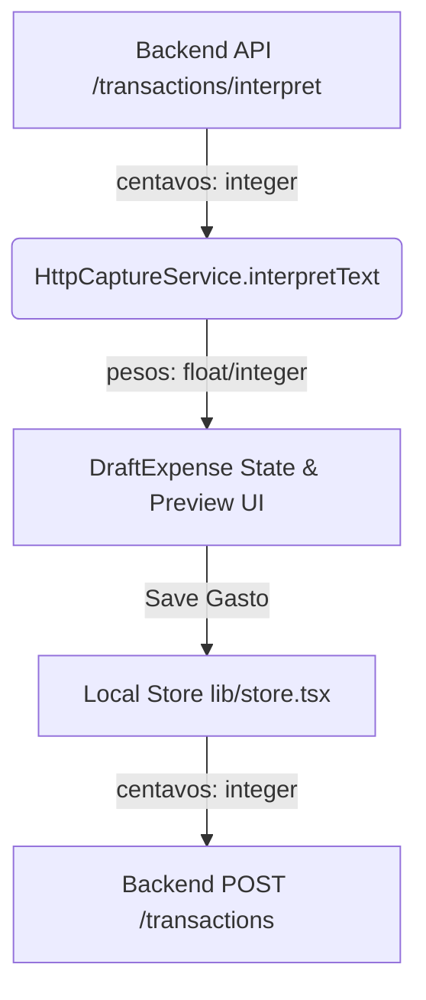

# Design: Unify Amount Unit on Centavos (Frontend)

This document provides the design architecture and detailed code changes for adapting the frontend capture flow to handle the backend transaction interpretation endpoint returning amounts in integer centavos instead of pesos.

## 1. Design System & Architecture Overview

The frontend budgeting application uses ARS pesos as its standard unit for local state, UI inputs, forms, and client-side validation logic. The backend API has standardized on integer centavos as its transaction currency representation.

To bridge this unit mismatch without polluting the UI and state management layers with centavos/pesos conversion checks, the network/API services must act as the **translation layer**.



- **Translation Layer**: `HttpCaptureService.interpretText` handles the mapping of `/transactions/interpret` responses. It divides the incoming `amount` (if present) by `100` to convert it from centavos to pesos before returning the parsed `Interpretation` to the client code.
- **Store Conversion**: When the user explicitly approves and saves the draft, `lib/store.tsx` handles the conversion back to centavos for persistence.

This architecture ensures that UI screens and layout components are strictly decoupled from backend currency unit details.

## 2. Component & State Design

The core Typescript domain interfaces remain **unchanged** and represent amounts in **pesos**:

- `Interpretation` (defined in `lib/format.ts`):
  ```typescript
  export interface Interpretation {
    description: string
    amount: number | null
    category: Category | null
  }
  ```
- `Expense` & `DraftExpense` (defined in `lib/types.ts`):
  Both represent `amount` in pesos.

This isolation ensures that all validation rules, formatting functions (such as `formatARS`), and manual entry flows continue to operate on pesos without modification.

## 3. Detailed Code Changes

### 3.1 Mapping in `lib/format.ts`

Modify the API response parsing logic inside [lib/format.ts](file:///home/nico/Escritorio/budgeting-workspace/budgeting-frontend/lib/format.ts):

```diff
-    // The `/transactions/interpret` draft endpoint returns `amount` in ARS
-    // pesos (not centavos, unlike the persisted transactions API). Preserve
-    // the value as-is for the preview; unit conversion for persisted
-    // expenses happens in `lib/store.tsx`.
-    const amount =
-      data.amount !== null && data.amount !== undefined ? data.amount : null
+    // The `/transactions/interpret` draft endpoint returns `amount` in integer
+    // centavos. We divide it by 100 to convert to pesos, which is the unit
+    // expected by the client-side `Interpretation` and UI draft preview.
+    const amount =
+      data.amount !== null && data.amount !== undefined ? data.amount / 100 : null
```

### 3.2 Unit Test Mocks in `lib/format.test.ts`

Update the mocked `/transactions/interpret` response in [lib/format.test.ts](file:///home/nico/Escritorio/budgeting-workspace/budgeting-frontend/lib/format.test.ts) to represent `3500` pesos as `350000` centavos:

```diff
     mockFetch.mockResolvedValueOnce({
       ok: true,
       status: 200,
       json: async () => ({
         description: 'Supermercado Coto',
-        amount: 3500,
+        amount: 350000,
         category: 'COMIDA',
       }),
     })
```

The assertion remains unchanged, verifying that the service maps `350000` centavos to `3500` pesos:

```typescript
expect(res).toEqual({
  description: 'Supermercado Coto',
  amount: 3500,
  category: 'COMIDA',
})
```

### 3.3 Integration Test Mocks in `components/screens/capture-screen.test.tsx`

Update the mocked response in [components/screens/capture-screen.test.tsx](file:///home/nico/Escritorio/budgeting-workspace/budgeting-frontend/components/screens/capture-screen.test.tsx) to represent `70000` pesos as `7000000` centavos:

```diff
     mockFetch.mockResolvedValueOnce({
       ok: true,
       status: 200,
       json: async () => ({
         description: '70 mil en el super',
-        amount: 70000,
+        amount: 7000000,
         category: 'COMIDA',
       }),
     })
```

The UI assertions verifying the display of `$70,000` pesos and persistence calls with `70000` remain unchanged.

## 4. Test Design & TDD Verification Steps

We will apply the strict TDD flow to verify correct unit conversion and prevent regression:

1. **Red Stage**:
   - Update only the mocks in `lib/format.test.ts` and `components/screens/capture-screen.test.tsx` to return the centavos representation (`350000` and `7000000`).
   - Run `pnpm test` to verify that tests fail (since the service returns $350,000 and $700,000 instead of $3,500 and $70,000).
2. **Green Stage**:
   - Implement the division by 100 in `HttpCaptureService.interpretText` within `lib/format.ts`.
   - Run `pnpm test` to verify that all unit and integration tests pass successfully.
3. **Refactor & Verification Stage**:
   - Run formatting check: `pnpm format:check`
   - Run lint checks: `pnpm lint`
   - Verify TypeScript compliance: `pnpm exec tsc --noEmit`
   - Execute production build: `pnpm build`
