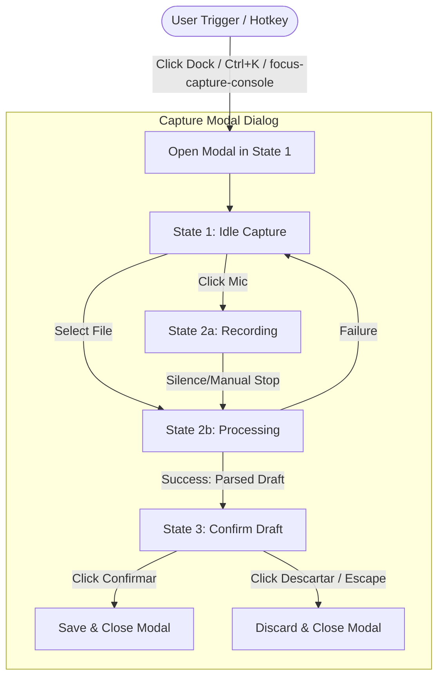

# Technical Design: Voice-Only Capture Console (Unified 3-State Modal Design)

This document specifies the visual, layout, and component-level designs for the simplified floating trigger button/dock and the unified 3-state Capture Modal Dialog, aligned with the Linear-inspired dark aesthetic.

## 1. Floating Trigger Button/Dock (`CaptureConsole` in `AppFrame`)

### 1.1 Structural Refactoring

- **Old Structure**: A multi-action dock container holding microphone icons, upload icons, and wave animations directly.
- **New Structure**: A single, clean button/dock containing:
  - Text label (e.g., `"Capturar gasto"`) OR a minimal microphone icon.
  - Keyboard shortcut indicator badge (e.g., `⌘K` or `Ctrl+K`).
- **Functionality**: Clicking this component only changes local/global state (e.g., `isOpen = true`) to open the Capture Modal Dialog.

### 1.2 Layout & Styling

- **Position**: `fixed bottom-8 left-1/2 -translate-x-1/2 z-50`
- **Tailwind Classes**:
  - `h-11 px-4 rounded-full flex items-center gap-2 bg-surface-2/80 backdrop-blur-xl border border-border/40 shadow-xl cursor-pointer hover:bg-surface-3 transition-all duration-300 hover:border-primary/40 hover:shadow-primary/5 active:scale-98`
- **Keyboard Shortcut Badge**:
  - `text-[10px] px-1.5 py-0.5 rounded bg-white/5 border border-white/10 text-muted-foreground ml-1.5 select-none font-mono`

---

## 2. Capture Modal Dialog Component

The modal container manages the 3-state pipeline. It MUST use an overlay backdrop and have smooth container dimension transitions when switching states.

### 2.1 Modal Backdrop Overlay

- **Backdrop**: `fixed inset-0 bg-background/60 backdrop-blur-sm z-50 flex items-center justify-center p-4`

### 2.2 Sizing & Dimension Transitions

- To prevent harsh visual jumping, the modal container MUST apply transition utilities for width and height:
  - **Base Container**: `w-full max-w-md bg-surface-1 border border-border/80 rounded-2xl shadow-2xl overflow-hidden transition-all duration-500 ease-out`
  - **State 1 & 2 Dimensions**: Compact profile (e.g., height approx. `240px`, width `400px`).
  - **State 3 Dimensions**: Form profile (e.g., height approx. `380px`, width `480px`).

### 2.3 State Visual Layouts

#### 2.3.1 State 1: Idle Capture Layout

- **Welcome Text**: `text-center font-medium text-foreground/90 text-base mb-4 mt-2` ("Contanos tu gasto y nosotros te lo cargamos").
- **Prominent Mic Trigger**:
  - `w-16 h-16 rounded-full bg-primary hover:bg-primary/90 text-white flex items-center justify-center mx-auto hover:scale-105 active:scale-95 transition-all duration-200 shadow-lg shadow-primary/20 cursor-pointer`
- **Audio File Upload**:
  - Located at the bottom or corner of the dialog block.
  - A small, low-contrast attachment trigger: `flex items-center justify-center gap-1.5 text-xs text-muted-foreground hover:text-foreground hover:bg-white/5 px-3 py-1.5 rounded-lg border border-border/40 cursor-pointer transition-all mt-4 mx-auto w-max`.

#### 2.3.2 State 2: Recording / Processing Layout

- **Active Recording View**:
  - Displays the recording text (e.g., `"Grabando audio..."`).
  - **Audio Wave Bars**: 4 vertical spans animating using a CSS `@keyframes wave` block.
    ```css
    @keyframes wave {
      0%,
      100% {
        transform: scaleY(0.4);
      }
      50% {
        transform: scaleY(1.4);
      }
    }
    .wave-bar {
      width: 4px;
      height: 24px;
      background-color: var(--primary);
      border-radius: 9999px;
      animation: wave 1.2s ease-in-out infinite;
    }
    ```
  - Spans are delayed sequentially (`animation-delay: 0.1s, 0.3s, 0.5s, 0.2s`).
  - Stop button: Clicking this stops recording and begins processing.
- **Processing View**:
  - Displays transcription & interpretation loading animation (e.g., a spinning circle or progressive gradient loader).
  - Progress text: `"Transcribiendo gasto..."` or `"Interpretando datos..."`.

#### 2.3.3 State 3: Confirm Draft Layout

- **Title**: `"Confirmar Gasto"` header.
- **Form Layout**:
  - Three structured fields in a stacked layout:
    - **Monto (ARS)**: Integer input field.
    - **Categoría**: Custom dropdown matching categories `'Supermercado' | 'Farmacia' | 'Auto'`.
    - **Descripción**: Text area or input.
- **Footer Buttons**:
  - **Descartar Button**: `px-4 py-2 text-sm text-muted-foreground hover:text-foreground hover:bg-white/5 rounded-lg transition-colors border border-border/20`
  - **Confirmar Gasto Button**: `px-4 py-2 text-sm bg-primary hover:bg-primary/95 text-white font-medium rounded-lg transition-all shadow-md shadow-primary/10`

---

## 3. State & Event Flows

The updated interactive flow matches this logic structure:



- **Keyboard Handler**:
  - Registers keydown listener on `window` object.
  - Matches `(e.metaKey || e.ctrlKey) && e.key === 'k'` to toggle modal open/close.
  - Matches `e.key === 'Escape'` to close the active modal and discard changes.
- **Custom Event Handler**:
  - Registers window listener for `'focus-capture-console'`.
  - Dispatches of this event set `isModalOpen = true` and `modalState = 'idle'`.
